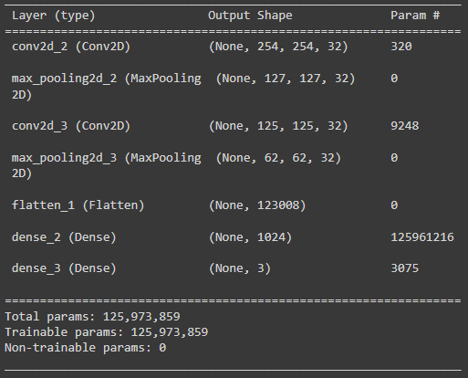

# Brain tumor axis detection using Convolutional Neural Network(CNN)

## Model summary

Detection of the model is done using Convolution Neural Network with three hidden 
layers. Essentially, this is a deep neural network. The dataset that I used for the 
training of the neural network consists of 3064 T1-weighted contrast-enhanced images 
from 233 patients. As the initial step “.jpg” images were generated and categorized 
into three categories Axial, Coronal and Sagittal. Afterwards, the data set was 
separated into training and testing data. The data division was 80% training data and 
20% testing data. The model summary is as follows.

> **_NOTE:_**  `plane_model.h5` is not included in the repo, and you 
> can run the `Cnn.py` and generate the model.